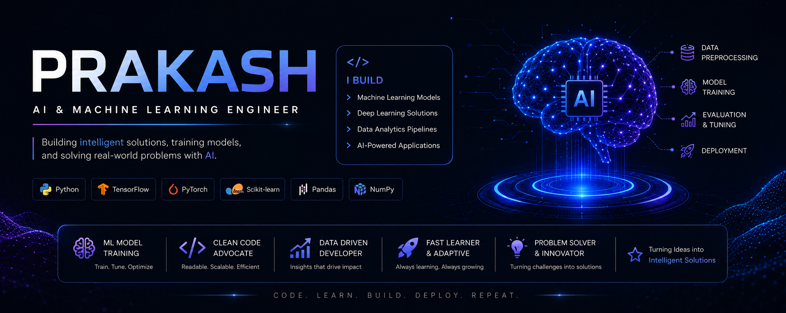

  

<h1 align="center">Hi 👋, I'm Uppara Prakash</h1>

<h3 align="center">
AI/ML Engineer | Generative AI Enthusiast | Python Developer
</h3>

Building Intelligent Systems with Machine Learning, Generative AI, FastAPI & Agentic AI

  

---

## 🚀 About Me

🎓 MSc Computer Science | Central University of Tamil Nadu (90%)

🤖 AI/ML Engineer | Generative AI Enthusiast | FastAPI Developer

🔍 Building AI Agents, RAG Applications, Machine Learning & Data Analytics Solutions

⚡ Passionate about solving real-world problems using Artificial Intelligence

📫 Reach me: prakashcutn07@gmail.com

📄 Resume:
[View Resume](YOUR_RESUME_LINK)

---

## 🌐 Connect With Me

---
# 💻 Skills & Technologies

<table>
<tr>
<td width="50%" valign="top">

### 🤖 AI & Machine Learning

</td>

<td width="50%" valign="top">

### 🧠 Generative AI

</td>
</tr>

<tr>
<td width="50%" valign="top">

### 📊 Data Analytics

</td>

<td width="50%" valign="top">

### ⚙️ Backend & APIs

</td>
</tr>

<tr>
<td width="50%" valign="top">

### 🌐 Frontend

</td>

<td width="50%" valign="top">

### 🛠️ Tools & Databases

</td>
</tr>
</table>

---

# 💼 Professional Journey & Key Achievements

  
  
  
  

> ### 🤖 AI Intern — Synycs Enterprises Pvt. Ltd.
> Developed an **AI-Powered Incident Management Agent** for incident analysis, root cause identification, and remediation automation.

> ### 🔬 Research Intern — IIIT Dharwad
> Evaluated **Machine Learning Models for Effective Fake URL Detection** using advanced ML techniques.

> ### 🎤 Research Presentation — Central University of Tamil Nadu
> Presented **Challenges & Opportunities of Deepfake Across Domains** at a national seminar.

> ### 🔐 Cybersecurity Internship — Cisco Networking Academy
> Gained practical exposure to **Cybersecurity, Network Security, and Threat Detection**.

---

# 📈 Contribution Graph

---

## 💡 Quote I Live By

> **"Artificial Intelligence is not just about building models — it's about building solutions that create real-world impact."**

---

⭐ If you like my work, consider following me and exploring my repositories.

